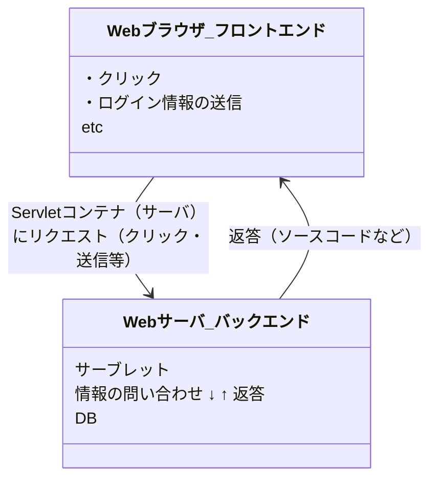

## サーブレット（Java Servlet）とは

- Webサーバ上（バックエンド）で動く、Javaで書かれたプログラムのこと。
- クライアント側からリクエストを送ると、その要求をサーブレットが受けてデータの処理をしたり、動的なWebページを作成する。
> 動的なwebページとは、同じURLをリクエストした場合でもアクセスした人によってページの見え方を変えて提供するページのこと。
> 動的なwebページを提供する方法の一つにサーブレットがある

### サーブレットコンテナとは

- サーブレットはJavaプログラムなので、実行環境が必要。その実行環境となるソフトウェアがサーブレットコンテナとなる。
- `HTTPリクエスト`は`サーブレットコンテナ`が受け取って、`サーブレットコンテナ`が`サーブレット`に対して処理の命令を出すといった流れになる

## サーブレットの動作について

例として会員のログイン
検索画面にURLを打ち込んで検索（GETメソッドでHTTPリクエスト）
ログインページが表示
ログインのためにID、PSを入力、submit（POSTメソッド、HTTPリクエスト）
受け取ったサーブレットはログイン情報があっていれば会員ページへ、ログイン失敗をすれば失敗ページをリダイレクトする