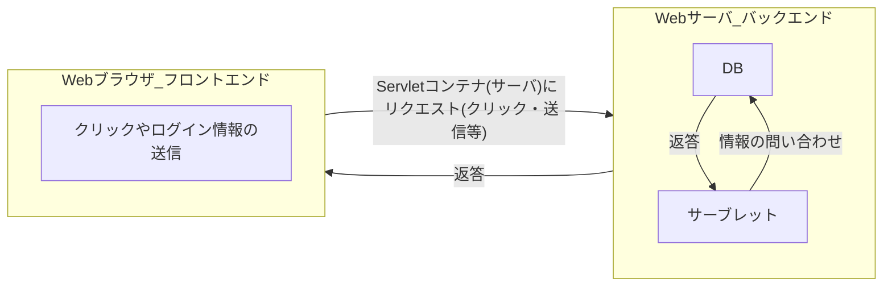

## サーブレット（Java Servlet）とは

- Webサーバ上（バックエンド）で動く、Javaで書かれたプログラムのこと。
- クライアント側からリクエストを送ると、その要求をサーブレットが受けてデータの処理をしたり、動的なWebページを作成する。
> 動的なwebページとは、同じURLをリクエストした場合でもアクセスした人によってページの見え方を変えて提供するページのこと。
> 動的なwebページを提供する方法の一つにサーブレットがある

### サーブレットコンテナとは

- サーブレットはJavaプログラムなので、実行環境が必要。その実行環境となるソフトウェアがサーブレットコンテナとなる。
- `HTTPリクエスト`は`サーブレットコンテナ`が受け取って、`サーブレットコンテナ`が`サーブレット`に対して処理の命令を出すといった流れになる

## サーブレットの動作について

例として会員のログイン
検索画面にURLを打ち込んで検索（GETメソッドでHTTPリクエスト）
ログインページが表示
ログインのためにID、PSを入力、submit（POSTメソッド、HTTPリクエスト）
受け取ったサーブレットはログイン情報があっていれば会員ページへ、ログイン失敗をすれば失敗ページをリダイレクトする

## サーブレットを使うメリットとは

> メリット1 : ライフサイクル管理

ライフサイクルとは、
処理が始まってから終わるまでの一連の流れのこと。

HPを見るときにクリックして他のページに遷移したり、ログインしたり、HTTPリクエストを複数回行う度に1回1回リクエストが送られてきて起動するのでは返答までに速度が遅くなるので、1回の訪問（セッション）を管理して、1度リクエストが送られてきたら、メモリに常駐してデータを維持することで返答までのスピードを速めることができる。

> メリット2 : マルチスレッド対応

マルチスレッドとは、同時に複数のタスクを処理すること。
複数のタスクをリクエストされると、プログラムが順番にこなしていくことになりますが、サーブレットの場合にはマルチスレッドに対応しているため、1秒間に数百回という速さで複数の処理を切り替えながら動作してパフォーマンスの向上を図る。

> メリット3：プラットフォームへの非依存

サーブレットはプラットフォームに依存しないJavaというプログラミング言語で作成されたプログラムのため、プログラム自体もOSやハードウェアなどのプラットフォームに依存しません。
Windows、macOS、Linuxのいずれであっても動作することが可能。
そのため、OSやハードウェアによって異なるプログラムを作成する必要はない。
また、プログラムを使用できるようにクライアント側の端末にアプリをダウンロードさせるものがありますが。サーブレットの場合にはダウンロード必要もない。どの端末からでも設定無しにプログラムを使えるのはサーブレットを使用するメリットの1つです。

> メリット4：追加するだけで機能拡張

サーブレットはモジュール化されています。
プログラムによっては、導入するために他の部分を書き換えなければ導入できないものもありますが、サーブレットに関してはサーブレットの部分を追加するだけで機能を拡張できるというメリットがあります。

## JSP(Java Server Pages)とは

